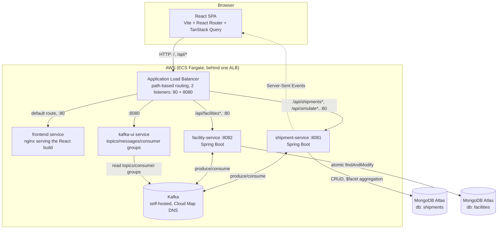
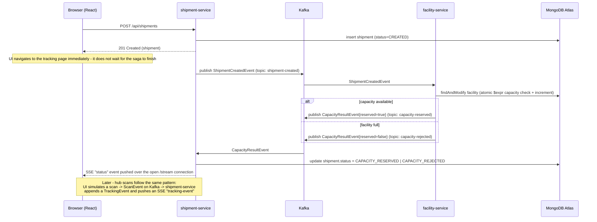

# UPS Tracker

An event-driven package shipment & delivery tracking system, modeled after a
UPS-style shipment lifecycle: **create shipment → reserve facility capacity
(saga) → hub scans → delivery**, with live status pushed to the browser as it
happens.

Built to exercise a realistic microservices stack end-to-end: React (hooks,
routing, forms, live data), Spring Boot, Kafka (event-driven saga), MongoDB
(aggregation pipelines), and a CloudFormation-deployed AWS environment.

---

## 1. Why this design (the interview pitch)

> "I built a shipment tracking system with two independently-deployable
> Spring Boot services that never call each other synchronously — they
> communicate only through Kafka events, coordinated as a saga with a
> compensating path for over-capacity rejections. The frontend gets live
> updates over Server-Sent Events instead of polling, and the ops dashboard
> is backed by a single MongoDB `$facet` aggregation instead of three
> separate queries. The whole thing deploys to AWS with one CloudFormation
> stack and tears down with one command."

That single paragraph is the thing to lead with; everything below is the
detail to back it up when asked to go deeper.

---

## 2. Architecture



**Why one ALB instead of separate load balancers per service:** the React
app's `fetch('/api/...')` calls stay same-origin (no CORS config, no
separate API base URL to manage per environment) because ALB path rules
route `/api/shipments*` and `/api/simulate*` to shipment-service,
`/api/facilities*` to facility-service, and everything else to the frontend
container.

**Why Kafka instead of direct REST calls between the two services:**
decouples shipment creation from the capacity decision. shipment-service
doesn't block on facility-service being up, doesn't need to know its
network address beyond a topic name, and the saga's compensating path
(capacity rejected → shipment marked `CAPACITY_REJECTED`) is just another
event, not a try/catch around an HTTP call.

---

## 3. The saga: what happens when you place a shipment



The key correctness point to be able to explain: the atomic capacity check
in facility-service is a single MongoDB `findAndModify` with an `$expr`
guard (`currentLoadKg + weightKg <= capacityKg`) and the increment in the
*same* operation — so two concurrent shipment-created events for the same
facility can't both read "there's room" before either writes back (see
`facility-service/.../service/CapacityService.java`).

---

## 4. Components

| Component | Tech | Responsibility |
|---|---|---|
| `frontend` | React 18, Vite, React Router, TanStack Query, react-hook-form, Recharts | Create-shipment form, shipment list (polling), live tracking timeline (SSE via a custom hook), ops dashboard, facility capacity view |
| `shipment-service` | Spring Boot, Spring Data MongoDB, Spring Kafka | Shipment CRUD, publishes `shipment-created`, consumes capacity results + scan events, SSE hub, `$facet` dashboard aggregation |
| `facility-service` | Spring Boot, Spring Data MongoDB, Spring Kafka | Facility CRUD, consumes `shipment-created`, atomically reserves/rejects capacity, publishes the saga result |
| Kafka | Bitnami Kafka (KRaft mode) | Topics: `shipment-created`, `capacity-reserved`, `capacity-rejected`, `scan-event` |
| MongoDB | Atlas (one cluster, two databases) | `shipments` db (shipment-service), `facilities` db (facility-service) — database-per-service even though they share a cluster |

---

## 4.1 React — 6 features to explain in an interview, with the actual code flow

Don't just name-drop these — walk through *what calls what* below. Each one
follows the same shape: the code, then the flow, then the one-sentence
answer to "why did you do it this way."

### 1. Custom hook wrapping a browser API (`useShipmentStream`)

```js
// frontend/src/hooks/useShipmentStream.js
export function useShipmentStream(shipmentId, initialEvents = []) {
  const [status, setStatus] = useState(null)
  const [events, setEvents] = useState(initialEvents)
  const eventsRef = useRef(initialEvents)

  useEffect(() => {
    if (!shipmentId) return undefined
    const source = new EventSource(`/api/shipments/${shipmentId}/stream`)

    source.addEventListener('status', (e) => setStatus(JSON.parse(e.data)))
    source.addEventListener('tracking-event', (e) => {
      const next = [...eventsRef.current, JSON.parse(e.data)]
      eventsRef.current = next
      setEvents(next)
    })

    return () => source.close()   // cleanup on unmount / shipmentId change
  }, [shipmentId])

  return { status, events }
}
```

**Code flow:** `TrackShipment.jsx` calls `useShipmentStream(id, initialEvents)`
→ the hook opens one `EventSource` connection to shipment-service's
`/stream` endpoint → every time the backend pushes an SSE `status` or
`tracking-event` message (see section 3's sequence diagram), the hook's
listeners fire and call `setStatus`/`setEvents` → React re-renders
`TrackShipment.jsx` with the new data, automatically, with zero polling.
The `return () => source.close()` line is the cleanup function — React
calls it when the component unmounts *or* before re-running the effect
(e.g. if you navigate from one shipment's tracking page to another,
`shipmentId` changes, the old connection closes, a new one opens).

**Why this way:** any imperative, subscription-based browser API
(`EventSource`, `WebSocket`, `IntersectionObserver`, `ResizeObserver`)
gets the same treatment — hide the subscribe/cleanup dance inside a hook so
consuming components just read state and never touch the raw API. This is
*the* canonical custom-hook interview example.

### 2. Server state vs. UI state, kept in two different places on purpose

```js
// frontend/src/pages/ShipmentList.jsx
const [statusFilter, setStatusFilter] = useState('')   // UI state
const [page, setPage] = useState(0)                     // UI state

const { data, isLoading, isError } = useQuery({          // server state
  queryKey: ['shipments', statusFilter, page],
  queryFn: () => api.listShipments({ status: statusFilter || undefined, page }),
  refetchInterval: 5000,
})
```

**Code flow:** `statusFilter`/`page` live in plain `useState` because
they're purely local UI selections. TanStack Query's `useQuery` owns the
actual server data — its `queryKey` array `['shipments', statusFilter, page]`
means: whenever `statusFilter` or `page` changes, TanStack Query
automatically treats that as a *different query*, refetches, and caches the
result separately per combination. `refetchInterval: 5000` re-runs it every
5 seconds regardless, so the list stays live as shipments move through
their saga. Selecting a new filter in the `<select>` triggers `setStatusFilter`
→ new `queryKey` → automatic refetch → new rows rendered. No manual
`useEffect(() => { fetch(...) }, [statusFilter])` anywhere.

**Why this way:** mixing the two — fetching inside a `useEffect` and storing
the result in `useState` — is the single most common React anti-pattern
(you end up hand-rolling loading/error/race-condition/cache-invalidation
logic that a data-fetching library already solved). Knowing to draw this
line is a strong signal in an interview.

### 3. Route-based code splitting

```js
// frontend/src/App.jsx
const CreateShipment = lazy(() => import('./pages/CreateShipment.jsx'))
const Dashboard = lazy(() => import('./pages/Dashboard.jsx'))
// ...

<Suspense fallback={<p>Loading…</p>}>
  <Routes>
    <Route path="/" element={<CreateShipment />} />
    <Route path="/dashboard" element={<Dashboard />} />
    {/* ... */}
  </Routes>
</Suspense>
```

**Code flow:** `lazy()` wraps a dynamic `import()` instead of a static one —
Vite turns each into its own JS chunk at build time. The first time a route
renders, React sees the lazy component isn't loaded yet, shows the nearest
`<Suspense fallback>`, kicks off the chunk's network request, and swaps in
the real component once it arrives. Visit only "/" and "/dashboard" in a
session, and the `Facilities.jsx`/`TrackShipment.jsx` chunks never download
at all.

**Why this way:** without it, one JS bundle contains every page's code
(including a charting library only the Dashboard needs), so first paint on
any page pays for code the user may never visit.

### 4. Controlled forms without a validation schema library

```js
// frontend/src/pages/CreateShipment.jsx
const { register, handleSubmit, formState: { errors } } = useForm()

<input {...register('senderName', { required: true })} />
{errors.senderName && <span className="error">Required</span>}
```

**Code flow:** `register('senderName', {...})` returns `{name, onChange,
onBlur, ref}`, spread onto the `<input>` — react-hook-form manages the
input's value **outside** React's render cycle via the DOM ref (an
"uncontrolled" input), only triggering a re-render when validation state
changes. On submit, `handleSubmit(onSubmit)` runs every field's rules,
populates `errors` if any fail, and only calls `onSubmit(formValues)` with
the assembled `CreateShipmentRequest` payload if everything passes.

**Why this way:** a fully-controlled form (`useState` per field +
`onChange` re-rendering the whole form on every keystroke) is the naive
approach and gets noticeably slower as a form grows; react-hook-form avoids
that re-render churn while still giving you per-field error state.

### 5. `useMemo` for derived data — clarity, not just performance

```js
// frontend/src/pages/Facilities.jsx
const summary = useMemo(() => {
  const totalCapacity = facilities.reduce((sum, f) => sum + f.capacityKg, 0)
  const totalLoad = facilities.reduce((sum, f) => sum + f.currentLoadKg, 0)
  const atRisk = facilities.filter((f) => f.currentLoadKg / f.capacityKg >= 0.7).length
  return { totalCapacity, totalLoad, overallPct: ..., atRisk }
}, [facilities])
```

**Code flow:** `facilities` comes from `useQuery` (refetched every 5s).
Every time it changes, `useMemo` recomputes `summary` in one place;
whenever `facilities` *hasn't* changed (e.g. some unrelated state update
re-renders this component), the memoized object is reused instead of
recalculated.

**Why this way — the interview nuance:** this isn't a performance
optimization (summing a handful of facilities is nearly free) — it's about
correctness and readability: one derivation, one dependency array, instead
of four separate `reduce`/`filter` calls scattered through the JSX. Know
the difference between "I used `useMemo` because profiling showed a real
cost" and "I used it to keep a derived value's computation in one place" —
conflating them is a common tell that a candidate is cargo-culting the hook.

### 6. `useEffect` for synchronization, not for fetching data

```js
// frontend/src/pages/TrackShipment.jsx
useEffect(() => {
  if (id) queryClient.invalidateQueries({ queryKey: ['next-scan-step', id] })
}, [id, currentStatus, events.length, queryClient])
```

**Code flow:** `currentStatus` and `events` are driven by the SSE hook from
feature #1 — they change as Kafka events arrive, entirely outside any user
click. This effect's job is to keep a *different* piece of server state
(the "what's the next valid scan?" query) in sync with those SSE-driven
changes, by telling TanStack Query to refetch it whenever status or the
event list changes.

**Why this way:** the effect doesn't fetch anything itself — it just
reacts to state that changed for reasons outside this component's control
and tells the *data layer* to refetch. That's the line the React docs draw
in "You Might Not Need an Effect": effects are for synchronizing with an
external system (or, as here, one part of your state with another), not a
general-purpose "run this after render" hook.

---

## 4.2 MongoDB — features and aggregation operators to talk about

| # | Feature | Where | Talking point |
|---|---|---|---|
| 1 | **`$facet` — multiple aggregations in one round trip** | [`DashboardService.buildDashboard()`](shipment-service/src/main/java/com/ups/shipment/service/DashboardService.java) | One query computes three independent results — status counts, daily volume, top destinations — each in its own pipeline branch, executed server-side in parallel. The alternative (3 separate `find`/`aggregate` calls) means 3 round trips and 3x the network overhead for the same answer. Powers every panel on the **Dashboard page**. |
| 2 | **`$group` + accumulators** | same file | `$group` by `status` (or `destinationFacilityId`, or a truncated date) with `$sum: 1` is the aggregation-pipeline equivalent of SQL's `GROUP BY ... COUNT(*)`. Know this mapping cold — it's the most commonly asked Mongo-vs-SQL translation question. |
| 3 | **`$dateToString` for date bucketing** | same file | Truncates `createdAt` (a `Date`) to a `"%Y-%m-%d"` string *before* grouping, so all shipments from the same calendar day collapse into one bucket — this is how you build a "volume per day" chart without pulling raw documents into the app and bucketing in Java. |
| 4 | **Atomic `findAndModify` with an `$expr` guard** | [`CapacityService.tryReserve()`](facility-service/src/main/java/com/ups/facility/service/CapacityService.java) | The single most important correctness detail in this whole project. `$expr: {$lte: [{$add: ["$currentLoadKg", weightKg]}, "$capacityKg"]}` combined with `$inc` in **one atomic operation** means the check-then-write can't race — two concurrent shipments booked into the same facility can't both pass the capacity check before either commits. Compare this to the naive (wrong) approach: `find()` the facility, check in application code, then `update()` — which has a TOCTOU race under concurrent load. This is what keeps the **Facilities page**'s capacity numbers correct under concurrent bookings. |
| 5 | **Indexes on query/sort fields** | [`Shipment.java`](shipment-service/src/main/java/com/ups/shipment/model/Shipment.java) | `@Indexed` on `status` and `createdAt` — the two fields the dashboard aggregation and the filtered shipment list both query/sort on. Know *why*: without an index, `$sort`/`$match` on these fields forces a full collection scan. |
| 6 | **Database-per-service, one cluster** | `application.yml` in both services | `shipments` and `facilities` are two separate logical databases in one Atlas cluster — each service only ever touches its own database, no cross-service `$lookup`. This is a deliberate microservices boundary (each service owns its data), kept even though sharing one cluster physically for cost reasons — a good "how would you explain a compromise you made" interview answer. |

---

## 5. Observability: tracing a request through the logs

Every service logs through SLF4J with a consistent one-line pattern
(`timestamp level [thread] logger - message`), and every business-event log
line embeds the shipment or facility id. A blanket `RequestLoggingFilter`
logs every HTTP request/response (method, path, status, duration) without
each controller having to do it manually, and a `@RestControllerAdvice`
centralizes unhandled-exception logging.

Locally, `docker compose logs -f` across the three services (plus each
service's own console) shows the whole saga in order. In AWS, all four ECS
services log to one CloudWatch log group (`/ecs/ups-tracker`), so a single
Logs Insights query traces one shipment end-to-end:

```
fields @timestamp, @log, @message
| filter @message like /<shipmentId>/
| sort @timestamp asc
```

That query surfaces, in order: the incoming `POST /api/shipments`, the
`ShipmentCreatedEvent` publish, facility-service's capacity check, the
`CapacityResultEvent` publish, shipment-service consuming it, and the SSE
push — i.e., the exact sequence in the diagram in section 3, reconstructed
purely from logs.

---

## 6. Running locally

1. Start infra:
   ```bash
   docker compose up -d
   ```
   Starts Mongo, Kafka (KRaft mode), and Kafka UI at http://localhost:8090.

2. Start the backends (each in its own terminal):
   ```bash
   cd shipment-service && mvn spring-boot:run
   cd facility-service && mvn spring-boot:run
   ```
   `facility-service` seeds 3 demo facilities on first boot.

3. Start the frontend:
   ```bash
   cd frontend
   npm install
   npm run dev
   ```
   Open http://localhost:5173.

### Demo flow
1. Create a shipment on the home page (pick origin/destination facilities).
2. You're redirected to the tracking page — within a second or two the
   status flips to `CAPACITY_RESERVED` (or `CAPACITY_REJECTED` if you
   overload a facility), pushed live via SSE.
3. Click the "Simulate hub scan" buttons to push `scan-event`s through
   Kafka and watch the tracking timeline update in real time.
4. Check the Dashboard page for aggregate stats and the Facilities page for
   capacity utilization.

---

## 7. Deploying to AWS (CloudFormation)

Full detail, prerequisites, and the exact commands live in
[`deploy/aws/README.md`](deploy/aws/README.md) — this section is the plan
and the reasoning behind it, useful for walking through in an interview.

### 7.0 AWS services/features used — what to say about each

| AWS service/feature | Where (template) | What it's doing here | Interview talking point |
|---|---|---|---|
| **CloudFormation** | `ecr.yaml`, `main.yaml` | Declares all infrastructure as versioned YAML; `aws cloudformation deploy` does diff-based create-or-update | "Infrastructure as code — the whole environment is reproducible from two files and one command, not click-ops." |
| **ECS on Fargate** | `EcsCluster`, all `AWS::ECS::TaskDefinition`/`AWS::ECS::Service` resources | Runs 5 containers (frontend, shipment-service, facility-service, Kafka, Kafka UI) with no EC2 instances to manage | "Serverless containers — I pay per task's requested vCPU/memory, AWS handles the underlying host." Know the trade-off vs. the EC2 launch type (bin-packing multiple tasks onto fewer, cheaper instances) if asked. |
| **Application Load Balancer + path-based routing** | `LoadBalancer`, `HttpListener`, `ShipmentListenerRule`, `FacilityListenerRule` | One ALB, one listener on port 80, routes `/api/shipments*`+`/api/simulate*` → shipment-service, `/api/facilities*` → facility-service, default → frontend | "Path-based routing means the React app's relative `fetch('/api/...')` calls stay same-origin — no CORS config, no per-environment API base URL." |
| **AWS Cloud Map (Service Discovery)** | `ServiceDiscoveryNamespace`, `KafkaDiscoveryService` | Private DNS namespace `ups.local`; Kafka registers itself as `kafka.ups.local`, resolvable by the other services regardless of which ENI/IP the task lands on | "Service discovery instead of hardcoding IPs — the same problem Kubernetes solves with its internal DNS, done natively in ECS." |
| **Amazon ECR** | `ecr.yaml` (3 repos) | Private Docker registry for the 3 images this project builds (Kafka and Kafka UI pull public images directly) | "Split into its own stack deliberately — images must exist before the ECS task defs in the main stack can reference them by URI, and ECR won't delete a non-empty repo, so cleanup order matters." |
| **IAM roles (least-privilege task execution role)** | `TaskExecutionRole` | One role, attached to every task definition, scoped to the AWS-managed `AmazonECSTaskExecutionRolePolicy` (ECR pull + CloudWatch Logs write only) | "Tasks don't get a broad role — just enough to pull their image and write logs." |
| **CloudWatch Logs** | `LogGroup`, `LogConfiguration` on every container definition | One log group (`/ecs/ups-tracker`), one stream prefix per service | "Every service logs to the same group with the shipment id embedded in each line, so one Logs Insights query traces a request across services and Kafka hops — see section 5." |
| **VPC, subnets, Internet Gateway, route tables** | `Vpc`, `PublicSubnet1/2`, `InternetGateway`, `PublicRouteTable` | 1 VPC, 2 public subnets (2 AZs, required for the ALB), one IGW, no NAT gateway | "Deliberately public-subnet-only for a demo deploy — tasks get public IPs and route straight to the IGW, no NAT gateway idle cost. I know this isn't the production pattern (see 7.4)." |
| **Security Groups** | `AlbSecurityGroup`, `ServiceSecurityGroup` | ALB SG allows inbound 80/8080 from anywhere; service SG allows all ports from the ALB SG and from itself (for inter-task Kafka traffic) | "Security groups model *who can talk to whom*, not just open ports — the self-referencing rule is what lets services reach Kafka without hardcoding an IP-based rule." |
| **Public IPv4 addressing** | `AssignPublicIp: ENABLED` on every service's `NetworkConfiguration` | Each Fargate task gets its own public IP since there's no NAT | "Know this has a real, non-obvious cost: AWS bills $0.005/hr per public IPv4 address since Feb 2024 — see the cost table in 7.5." |

### 7.1 Target architecture

Same diagram as section 2. Concretely, in AWS:

- **1 VPC**, 2 public subnets across 2 AZs, an Internet Gateway, no NAT
  gateway (deliberate cost simplification — see 7.4).
- **1 ECS Fargate cluster** running 5 services: `frontend`,
  `shipment-service`, `facility-service`, `kafka`, `kafka-ui` (all in the
  public subnets with public IPs, since there's no NAT for private-subnet
  egress).
- **1 Application Load Balancer**, 2 listeners (port 80 for the app, port
  8080 for Kafka UI), 4 target groups, 2 path-based listener rules
  (shipment / facility) plus a default route to the frontend target group.
- **1 Cloud Map private DNS namespace** (`ups.local`) so
  shipment-service/facility-service/kafka-ui can reach Kafka at a stable
  `kafka.ups.local:9092` regardless of which ENI the Kafka task lands on.
- **3 ECR repositories** (one per buildable image — Kafka and Kafka UI pull
  public images directly, so they don't need one).
- **MongoDB Atlas** — external, not provisioned by CloudFormation.

### 7.2 Why two CloudFormation stacks, not one

- `ecr.yaml` — just the 3 ECR repositories.
- `main.yaml` — everything else (VPC, ALB, ECS cluster, Cloud Map, all 4
  services).

They're split because of a hard ordering dependency: Docker images must be
built and pushed to ECR *before* the ECS task definitions in `main.yaml` can
reference them by URI, and CloudFormation can't "pause" a single stack
deploy for you to run `docker push` in the middle. Splitting also makes
cleanup correct: ECR won't let you delete a repository that still has
images in it, so `cleanup.sh` empties the repos before deleting the ECR
stack, independent of the main stack's lifecycle.

### 7.3 Deployment sequence (what `deploy.sh` does)

1. **Deploy `ecr.yaml`** — creates (or no-ops on) the 3 repositories.
2. **Read the repo URIs** from the stack's outputs.
3. **`docker login` to ECR**, then **build and push** all three images
   (`shipment-service`, `facility-service`, `frontend`), tagged with a
   timestamp so every deploy is traceable to a specific image and rollbacks
   are just "redeploy with the previous tag."
4. **Deploy `main.yaml`**, passing the three image URIs and the MongoDB
   Atlas connection string as parameters. CloudFormation creates the VPC,
   networking, security groups, the ALB and its target groups/listener
   rules, the Cloud Map namespace, and all 4 ECS services — in dependency
   order, automatically, via `DependsOn` and implicit `!Ref`/`!GetAtt`
   dependencies in the template.
5. **Print the ALB DNS name** as the app URL.

Re-running `deploy.sh` after a code change is the same sequence — new image
tags, `cloudformation deploy` performs a diff-based stack update, and ECS
does a rolling deployment of just the services whose task definition
changed.

### 7.4 Deliberate simplifications (be ready to name these if asked "what would you change for production?")

| Simplification | Production alternative |
|---|---|
| Public subnets only, no NAT gateway | Private subnets for ECS tasks + NAT gateway (or VPC endpoints) for egress, ALB stays in public subnets |
| Self-hosted single-task Kafka | Amazon MSK (managed, replicated, no single point of failure) |
| No HTTPS | ACM certificate + HTTPS listener on the ALB, redirect 80→443 |
| MongoDB Atlas reachable from `0.0.0.0/0` | VPC peering or PrivateLink from the VPC to Atlas, restrict the Atlas IP allowlist |
| No autoscaling | ECS Service Auto Scaling on CPU/memory or ALB request count |
| Fixed image tags via `--parameter-overrides` | A proper CI/CD pipeline (CodePipeline/GitHub Actions) building and deploying on every merge, with a Terraform/CDK option instead of hand-written CloudFormation for larger teams |
| One shared CloudFormation stack per environment | Separate stacks per environment (dev/staging/prod) with parameter files, or nested stacks as the template grows |

### 7.5 Cost

Estimated AWS cost (us-east-1, on-demand pricing) if the stack were left
running continuously:

| Resource | Spec | Cost if run 24/7 (730 hrs) |
|---|---|---|
| shipment-service task | 0.5 vCPU / 1 GB | ~$18/mo |
| facility-service task | 0.5 vCPU / 1 GB | ~$18/mo |
| kafka task | 0.5 vCPU / 1 GB | ~$18/mo |
| kafka-ui task | 0.25 vCPU / 0.5 GB | ~$9/mo |
| frontend task | 0.25 vCPU / 0.5 GB | ~$9/mo |
| ALB (2 listeners: 80, 8080) | base + light LCU usage | ~$16-25/mo |
| Public IPv4 addresses | 5 ECS tasks + ALB, $0.005/hr each | ~$18-22/mo |
| CloudWatch Logs, ECR storage, data transfer | demo-level volume | ~$2-5/mo |
| NAT Gateway | none — public subnets by design | $0 |
| MongoDB Atlas | free M0 tier | $0 |
| **Total, always-on** | | **~$110-125/mo** |

None of these are fixed costs of "having deployed it" — they're hourly, so
the number that actually matters is *how long the stack stays up*, not
whether it exists. The ALB in particular has no cheaper mode (~$0.0225/hr
flat regardless of traffic); the only lever is section 7.6's run/cleanup
discipline, which brings a demo session to well under $1-2 total.

### 7.6 Cleanup

```bash
cd deploy/aws
./cleanup.sh
```

Deletes the main stack (this is where all the hourly cost lives — ECS
tasks, ALB), empties the ECR repos, then deletes the ECR stack. Nothing
left behind bills after both stacks are gone. The MongoDB Atlas cluster is
separate and unaffected — clean that up in the Atlas console if you're done
with it.

---

## 8. Project layout

```
ups-tracker/
  docker-compose.yml       # local Mongo + Kafka + Kafka UI
  shipment-service/        # Spring Boot, port 8081
  facility-service/        # Spring Boot, port 8082
  frontend/                # React + Vite, port 5173
  deploy/aws/
    ecr.yaml               # ECR repos (separate stack)
    main.yaml              # VPC, ALB, ECS cluster, 5 services
    deploy.sh               # build/push images, deploy both stacks
    cleanup.sh               # delete both stacks, empty ECR first
    config.env.example      # AWS_REGION + MONGO_ATLAS_URI
    README.md               # deploy prerequisites and commands
```
