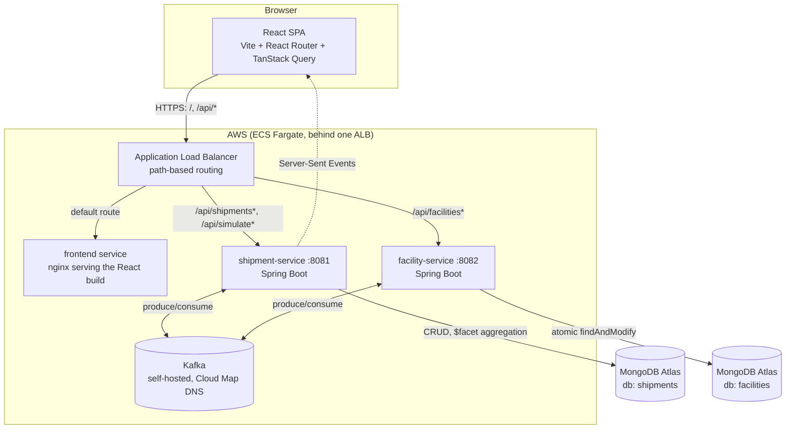
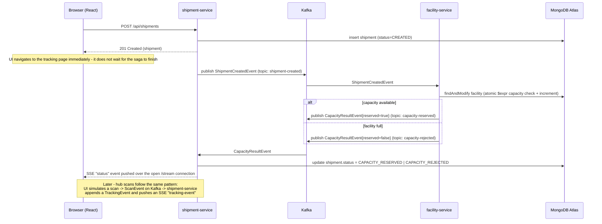

# UPS Tracker

An event-driven package shipment & delivery tracking system, modeled after a
UPS-style shipment lifecycle: **create shipment → reserve facility capacity
(saga) → hub scans → delivery**, with live status pushed to the browser as it
happens.

Built to exercise a realistic microservices stack end-to-end: React (hooks,
routing, forms, live data), Spring Boot, Kafka (event-driven saga), MongoDB
(aggregation pipelines), and a CloudFormation-deployed AWS environment.

---

## 1. Why this design (the interview pitch)

> "I built a shipment tracking system with two independently-deployable
> Spring Boot services that never call each other synchronously — they
> communicate only through Kafka events, coordinated as a saga with a
> compensating path for over-capacity rejections. The frontend gets live
> updates over Server-Sent Events instead of polling, and the ops dashboard
> is backed by a single MongoDB `$facet` aggregation instead of three
> separate queries. The whole thing deploys to AWS with one CloudFormation
> stack and tears down with one command."

That single paragraph is the thing to lead with; everything below is the
detail to back it up when asked to go deeper.

---

## 2. Architecture



**Why one ALB instead of separate load balancers per service:** the React
app's `fetch('/api/...')` calls stay same-origin (no CORS config, no
separate API base URL to manage per environment) because ALB path rules
route `/api/shipments*` and `/api/simulate*` to shipment-service,
`/api/facilities*` to facility-service, and everything else to the frontend
container.

**Why Kafka instead of direct REST calls between the two services:**
decouples shipment creation from the capacity decision. shipment-service
doesn't block on facility-service being up, doesn't need to know its
network address beyond a topic name, and the saga's compensating path
(capacity rejected → shipment marked `CAPACITY_REJECTED`) is just another
event, not a try/catch around an HTTP call.

---

## 3. The saga: what happens when you place a shipment



The key correctness point to be able to explain: the atomic capacity check
in facility-service is a single MongoDB `findAndModify` with an `$expr`
guard (`currentLoadKg + weightKg <= capacityKg`) and the increment in the
*same* operation — so two concurrent shipment-created events for the same
facility can't both read "there's room" before either writes back (see
`facility-service/.../service/CapacityService.java`).

---

## 4. Components

| Component | Tech | Responsibility |
|---|---|---|
| `frontend` | React 18, Vite, React Router, TanStack Query, react-hook-form, Recharts | Create-shipment form, shipment list (polling), live tracking timeline (SSE via a custom hook), ops dashboard, facility capacity view |
| `shipment-service` | Spring Boot, Spring Data MongoDB, Spring Kafka | Shipment CRUD, publishes `shipment-created`, consumes capacity results + scan events, SSE hub, `$facet` dashboard aggregation |
| `facility-service` | Spring Boot, Spring Data MongoDB, Spring Kafka | Facility CRUD, consumes `shipment-created`, atomically reserves/rejects capacity, publishes the saga result |
| Kafka | Bitnami Kafka (KRaft mode) | Topics: `shipment-created`, `capacity-reserved`, `capacity-rejected`, `scan-event` |
| MongoDB | Atlas (one cluster, two databases) | `shipments` db (shipment-service), `facilities` db (facility-service) — database-per-service even though they share a cluster |

### React features exercised
Hooks (`useState`, `useEffect`, `useMemo`, custom hooks), React Router with
`React.lazy`/`Suspense` code-splitting, controlled forms via
`react-hook-form`, server state via TanStack Query (caching, polling,
mutations), Server-Sent Events consumed through a custom
`useShipmentStream` hook, and a small reusable component
(`<StatusBadge>`).

### MongoDB features exercised
- **Aggregation `$facet`**: the dashboard computes status counts, daily
  volume, and top destination facilities in one round trip
  (`DashboardService.buildDashboard()`).
- **Atomic `findAndModify` with `$expr`**: the capacity reservation saga
  step (`CapacityService.tryReserve()`).
- **Indexes**: `status` and `createdAt` on `shipments` for the dashboard and
  filtered list queries.
- **Database-per-service**: two logical databases in one Atlas cluster,
  never queried across each other directly (no cross-service `$lookup`) —
  that boundary is intentional and mirrors how you'd design this against
  two entirely separate clusters in production.

---

## 5. Observability: tracing a request through the logs

Every service logs through SLF4J with a consistent one-line pattern
(`timestamp level [thread] logger - message`), and every business-event log
line embeds the shipment or facility id. A blanket `RequestLoggingFilter`
logs every HTTP request/response (method, path, status, duration) without
each controller having to do it manually, and a `@RestControllerAdvice`
centralizes unhandled-exception logging.

Locally, `docker compose logs -f` across the three services (plus each
service's own console) shows the whole saga in order. In AWS, all four ECS
services log to one CloudWatch log group (`/ecs/ups-tracker`), so a single
Logs Insights query traces one shipment end-to-end:

```
fields @timestamp, @log, @message
| filter @message like /<shipmentId>/
| sort @timestamp asc
```

That query surfaces, in order: the incoming `POST /api/shipments`, the
`ShipmentCreatedEvent` publish, facility-service's capacity check, the
`CapacityResultEvent` publish, shipment-service consuming it, and the SSE
push — i.e., the exact sequence in the diagram in section 3, reconstructed
purely from logs.

---

## 6. Running locally

1. Start infra:
   ```bash
   docker compose up -d
   ```
   Starts Mongo, Kafka (KRaft mode), and Kafka UI at http://localhost:8090.

2. Start the backends (each in its own terminal):
   ```bash
   cd shipment-service && mvn spring-boot:run
   cd facility-service && mvn spring-boot:run
   ```
   `facility-service` seeds 3 demo facilities on first boot.

3. Start the frontend:
   ```bash
   cd frontend
   npm install
   npm run dev
   ```
   Open http://localhost:5173.

### Demo flow
1. Create a shipment on the home page (pick origin/destination facilities).
2. You're redirected to the tracking page — within a second or two the
   status flips to `CAPACITY_RESERVED` (or `CAPACITY_REJECTED` if you
   overload a facility), pushed live via SSE.
3. Click the "Simulate hub scan" buttons to push `scan-event`s through
   Kafka and watch the tracking timeline update in real time.
4. Check the Dashboard page for aggregate stats and the Facilities page for
   capacity utilization.

---

## 7. Deploying to AWS (CloudFormation)

Full detail, prerequisites, and the exact commands live in
[`deploy/aws/README.md`](deploy/aws/README.md) — this section is the plan
and the reasoning behind it, useful for walking through in an interview.

### 7.1 Target architecture

Same diagram as section 2. Concretely, in AWS:

- **1 VPC**, 2 public subnets across 2 AZs, an Internet Gateway, no NAT
  gateway (deliberate cost simplification — see 7.4).
- **1 ECS Fargate cluster** running 4 services: `frontend`,
  `shipment-service`, `facility-service`, `kafka` (all in the public
  subnets with public IPs, since there's no NAT for private-subnet egress).
- **1 Application Load Balancer**, 1 listener (port 80), 3 target groups,
  2 path-based listener rules (shipment / facility) plus a default route to
  the frontend target group.
- **1 Cloud Map private DNS namespace** (`ups.local`) so
  shipment-service/facility-service can reach Kafka at a stable
  `kafka.ups.local:9092` regardless of which ENI the Kafka task lands on.
- **3 ECR repositories** (one per buildable image — Kafka pulls the public
  Bitnami image directly, so it doesn't need one).
- **MongoDB Atlas** — external, not provisioned by CloudFormation.

### 7.2 Why two CloudFormation stacks, not one

- `ecr.yaml` — just the 3 ECR repositories.
- `main.yaml` — everything else (VPC, ALB, ECS cluster, Cloud Map, all 4
  services).

They're split because of a hard ordering dependency: Docker images must be
built and pushed to ECR *before* the ECS task definitions in `main.yaml` can
reference them by URI, and CloudFormation can't "pause" a single stack
deploy for you to run `docker push` in the middle. Splitting also makes
cleanup correct: ECR won't let you delete a repository that still has
images in it, so `cleanup.sh` empties the repos before deleting the ECR
stack, independent of the main stack's lifecycle.

### 7.3 Deployment sequence (what `deploy.sh` does)

1. **Deploy `ecr.yaml`** — creates (or no-ops on) the 3 repositories.
2. **Read the repo URIs** from the stack's outputs.
3. **`docker login` to ECR**, then **build and push** all three images
   (`shipment-service`, `facility-service`, `frontend`), tagged with a
   timestamp so every deploy is traceable to a specific image and rollbacks
   are just "redeploy with the previous tag."
4. **Deploy `main.yaml`**, passing the three image URIs and the MongoDB
   Atlas connection string as parameters. CloudFormation creates the VPC,
   networking, security groups, the ALB and its target groups/listener
   rules, the Cloud Map namespace, and all 4 ECS services — in dependency
   order, automatically, via `DependsOn` and implicit `!Ref`/`!GetAtt`
   dependencies in the template.
5. **Print the ALB DNS name** as the app URL.

Re-running `deploy.sh` after a code change is the same sequence — new image
tags, `cloudformation deploy` performs a diff-based stack update, and ECS
does a rolling deployment of just the services whose task definition
changed.

### 7.4 Deliberate simplifications (be ready to name these if asked "what would you change for production?")

| Simplification | Production alternative |
|---|---|
| Public subnets only, no NAT gateway | Private subnets for ECS tasks + NAT gateway (or VPC endpoints) for egress, ALB stays in public subnets |
| Self-hosted single-task Kafka | Amazon MSK (managed, replicated, no single point of failure) |
| No HTTPS | ACM certificate + HTTPS listener on the ALB, redirect 80→443 |
| MongoDB Atlas reachable from `0.0.0.0/0` | VPC peering or PrivateLink from the VPC to Atlas, restrict the Atlas IP allowlist |
| No autoscaling | ECS Service Auto Scaling on CPU/memory or ALB request count |
| Fixed image tags via `--parameter-overrides` | A proper CI/CD pipeline (CodePipeline/GitHub Actions) building and deploying on every merge, with a Terraform/CDK option instead of hand-written CloudFormation for larger teams |
| One shared CloudFormation stack per environment | Separate stacks per environment (dev/staging/prod) with parameter files, or nested stacks as the template grows |

### 7.5 Cleanup

```bash
cd deploy/aws
./cleanup.sh
```

Deletes the main stack (this is where all the hourly cost lives — ECS
tasks, ALB), empties the ECR repos, then deletes the ECR stack. Nothing
left behind bills after both stacks are gone. The MongoDB Atlas cluster is
separate and unaffected — clean that up in the Atlas console if you're done
with it.

---

## 8. Project layout

```
ups-tracker/
  docker-compose.yml       # local Mongo + Kafka + Kafka UI
  shipment-service/        # Spring Boot, port 8081
  facility-service/        # Spring Boot, port 8082
  frontend/                # React + Vite, port 5173
  deploy/aws/
    ecr.yaml               # ECR repos (separate stack)
    main.yaml              # VPC, ALB, ECS cluster, 4 services
    deploy.sh               # build/push images, deploy both stacks
    cleanup.sh               # delete both stacks, empty ECR first
    config.env.example      # AWS_REGION + MONGO_ATLAS_URI
    README.md               # deploy prerequisites and commands
```
